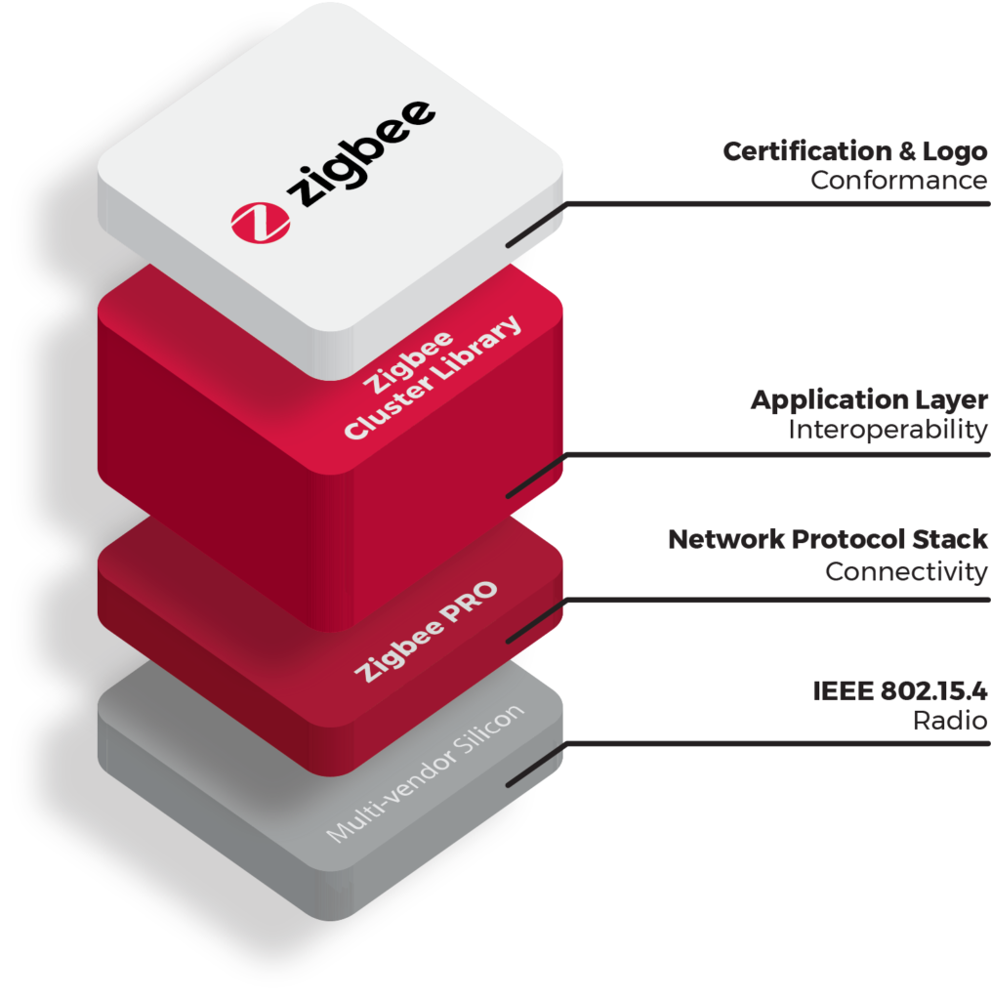

# ZigBee

## Why Zigbee 3.0

Zigbee 3.0 increases choice and flexibility for users and developers, and delivers the confidence that products and services will all work together through standardization at all layers of the stack.  The Zigbee 3.0 solution includes testing, certification, branding and marketing support to make it easier to develop and sell interoperable products and solutions. It unlocks growth opportunities while fueling innovation to enable new capabilities at home, work and on the road.

Zigbee 3.0 is built on the Zigbee PRO, which enhances the IEEE 802.15.4 standard by adding mesh network and security layers along with an application framework and to become a full stack, low-power certifiable, interoperable Zigbee solution.

## Benefits of Zigbee 3.0

### It is interoperable

* Certification ensures device-to-device interoperability
* A single application language provides for multi-vendor ecosystems
* Designed for forward and backward compatibility
	+ Legacy devices may join a Zigbee 3.0 network
	+ Zigbee 3.0 devices will join legacy networks

### It is a single solution for all markets

* Home, building, industrial, retail, health, and more
* As a single choice for developers and consumers, it ends market fragmentation
* Includes the application layer for complete implementations

### It is easy

* All necessary documents in a single location
* A single certification mark on every certified product and package
* Multiple options for chip, stack, and module vendors means you are not locked-in to a single supplier
* Many ODMs currently offering components and modules for simplified development process

### It is reliable and robust

* Proven mesh network eliminates single points of failure and provides for large networks
* Self-healing and scalable abilities provide for networks with hundreds of devices

### It is global

* 2.4 GHz ISM band usage ensures license free product deployment worldwide

### It is proven

* Over 2,500 products certified and 300 million products deployed

### It is green

* The network is designed to work with energy harvesting and ultra-low power products
* Every Zigbee routing device supports Green Power proxy technology assuring mesh support for energy harvesting products

### It is future-proof

* Brought to market with support from over 400 member companies with decades of experience in the IoT industry
* A history of innovation – some of the largest, smallest, oldest and newest companies in the industry

### It is well-tested

* Comprehensive testing and certification programs covering MAC/PHY, network, and applications/product layers

### It is built on Zigbee PRO

* Allows cross-band communication across 2.4GHz and sub-GHz bands with multi PHY support
* Enables global operation in the 2.4GHz frequency band according to IEEE 802.15.4
* Enables regional operation in the 915Mhz and 868Mhz
* Incorporates power saving mechanisms for all device classes, plus support for battery-less devices
* Features security key generation mechanism, as well as discovery and pairing mechanism with full application confirmation
* Includes mesh topology and inter-personal area network (PAN) communication
* Offers various transmission options including broadcast, groupcast and unicast
* Utilizes the industry standard AES-128 security scheme
* Supports Alliance standards or manufacturer-specific innovations
* Includes power measurements to reduce power output enabling devices to communicate at the exact level of power required
* Sub-GHz channels transmission ranges up to 1km

## Technical Specifications

Solution                  | Description
--------------------------|-----------------------------------------------------
Network Protocol          | Zigbee PRO 2015 (or newer)
Network Topology          | Self-Forming, Self-Healing MESH
Network Device Types      | Coordinator (routing capable), Router, End Device, Zigbee Green Power Device
Network Size (# of nodes) | Up to 65,000
Radio Technology          | IEEE 802.15.4-2011
Frequency Band / Channels | 2.4 GHz (ISM band)
"                         | 16-channels (2 MHz wide)
Data Rate                 | 250 Kbits/sec
Security Models	          | Centralized (with Install Codes support)
"                         | Distributed
Encryption Support        | AES-128 at Network Layer
"                         | AES-128 available at Application Layer
Communication Range       | Up to 300+ meters (line of sight)
(Average)                 | Up to 75-100 meters indoor
Low Power Support         | Sleeping End Devices
"                         | Zigbee Green Power Devices (energy harvesting)
Legacy profile support    | Zigbee 3 devices can join legacy Zigbee profile networks.
"                         | Legacy devices may join Zigbee 3 networks (based on network’s security policy)
Logical device support	  | Each physical device may support up to 240 end-points (logical devices)
